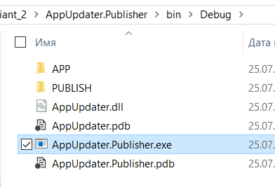
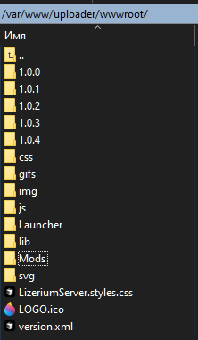

<h1 align="center">💽 Lizerium Launcher 💽</h1>

<p align="center">
  
  
  
  
  
  
</p>

<p align="center">
  
  
  
  
  
  
</p>

<p align="center">
  <b>Lizerium Launcher</b> — лаунчер и система постепенного обновления клиента и игровых модификаций
  для экосистемы <b>Lizerium</b>, рассчитанная на минимальный трафик, контроль версий и серверную публикацию.
</p>

# Оглавление

- [Оглавление](#оглавление)
  - [Общее](#общее)
  - [Технологии](#технологии)
  - [Сборка](#сборка)
  - [Формирование файлов `обновления приложения LizeriumLauncher` на сервер (`LizeriumServer`)](#формирование-файлов-обновления-приложения-lizeriumlauncher-на-сервер-lizeriumserver)
    - [Подготовка перед публикацией](#подготовка-перед-публикацией)
    - [Генерация файлов обновления](#генерация-файлов-обновления)
    - [Параметры](#параметры)
    - [Публикация на сервер](#публикация-на-сервер)
  - [💣 Формирование файлов `модов` для сервера (`LizeriumServer`)](#-формирование-файлов-модов-для-сервера-lizeriumserver)
    - [Структура папок мода на сервере](#структура-папок-мода-на-сервере)
    - [Генерация файлов публикации мода](#генерация-файлов-публикации-мода)
    - [Загрузка файлов мода на сервер](#загрузка-файлов-мода-на-сервер)
    - [Файл версии мода](#файл-версии-мода)
    - [Архивы обновлений](#архивы-обновлений)
    - [Содержимое архива обновления](#содержимое-архива-обновления)
      - [`manifest.launcher`](#manifestlauncher)
      - [`updates_info.json`](#updates_infojson)
    - [Что должно лежать внутри архива обновления](#что-должно-лежать-внутри-архива-обновления)
  - [Другое](#другое)

## Общее


> [!IMPORTANT]
> Цель компонента — обеспечить постоянное и постепенное обновление приложений без вмешательства пользователя.
> Поведение аналогично механике обновления Google Chrome: каждое обновление загружает минимально возможный объём данных.

## Технологии

- WPF
- Prism.Unity

## Сборка

- [Файл с инструкцией](docs/BUILD.md)

## Формирование файлов `обновления приложения LizeriumLauncher` на сервер (`LizeriumServer`)

- Компонент для публикации: [AppUpdater.Publisher](AppUpdater.Publisher/bin/Release)

  

### Подготовка перед публикацией

Перед формированием новой версии необходимо:

1. Указать в `config.xml` лаунчера:
   - актуальную версию приложения в поле `<version>`
   - предыдущую версию в поле `<last_version>`
   - адрес сервера обновлений в `updateServer`, например:

   ```xml
   <updateServer>https://lizup.ru/uploader/</updateServer>
   ```

2. Проверить пути до Freelancer и мода — они должны быть стандартными.

3. Поместить `config.xml` внутрь папки с обновлением (например, `1.0.5`) **до сборки**.

4. Подписать все созданные вами библиотеки электронной подписью через **kSign** с использованием ключа `dvurechensky.pfx`.

5. Удалить лишние:
   - `.pdb` файлы
   - лог-файлы, если они были созданы в процессе сборки или тестирования

### Генерация файлов обновления

Запускаем в **PowerShell** команду:

```bash
.\AppUpdater.Publisher.exe -source:{AppFolder} -target:{ReleaseFolder} -version:{X.X.X} -deltas:{X}
```

### Параметры

1. `-source` — путь до собранного свежего приложения
2. `-target` — папка публикации, из которой новая версия будет загружена на сервер обновлений
3. `-version` — номер версии приложения, который обычно зашивается при сборке (`1.0.0`, `1.2.3` и т.д.) и указывается в конфигурации
4. `-deltas` — количество предыдущих версий, для которых будут сформированы дельта-обновления
   Рекомендуемое значение: `2`

<details>
<summary>Пример</summary>

```sh
.\AppUpdater.Publisher.exe -source:..\..\..\TestApp\bin\Debug\ -target:.\PUBLISH\ -version:1.2.5 -deltas:2
```

> Актуальная команда

```sh
.\AppUpdater.Publisher.exe -source:..\..\..\LizeriumLauncher\bin\Release\ -target:.\PUBLISH\ -version:1.0.1 -deltas:2
```

</details>

### Публикация на сервер

После генерации необходимо загрузить на сервер:

- новый [`version.xml`](AppUpdater.Publisher/bin/Release/PUBLISH/version.xml), в котором указана последняя версия приложения
- папку с этой версией из [`PUBLISH`](AppUpdater.Publisher/bin/Release/PUBLISH)

То есть, если собиралась версия `1.0.4`, то в корень папки `uploader` на сервере (`LizeriumServer`) необходимо положить:

- `version.xml`
- папку `1.0.4`

Пример структуры:

```text
uploader/
├── version.xml
└── 1.0.4/
```



---

## 💣 Формирование файлов `модов` для сервера (`LizeriumServer`)

### Структура папок мода на сервере

Для мода `LizeriumFreelancerMode` на `LizeriumServer` используется следующая структура:

```text
Mods/
└── LizeriumFreelancerMode/
    ├── 99.3.4/
    ├── updates/
    └── version.xml
```

### Генерация файлов публикации мода

При публикации мода необходимо:

- сгенерировать `manifest.xml`
- подготовить установочные файлы к `deploy`

Эти файлы будут размещены в каталоге:

```text
Mods/LizeriumFreelancerMode/99.3.4
```

Для этого используется Publisher из проекта [AppUpdater.Publisher](AppUpdater.Publisher/bin/Release)

> Команда генерации

```sh
.\AppUpdater.Publisher.exe -source:.\INPUT\3_FL_APP\ -target:.\MODS\ -version:99.3.4 -deltas:2
```

> [!IMPORTANT]
> Дополнительно необходимо дробить игровые файлы на `.bin` части как можно меньшего размера.
> Это делается через **Inno Setup** скрипт, который лежит первым в проекте (у вас может быть свой скрипт и свой вариант дробления), например:
>
> ```text
> 99.3.4.iss
> ```

### Загрузка файлов мода на сервер

После генерации файлов публикации необходимо забрать всё содержимое из папки со сформированными бинарниками и перенести его вместе с манифестом внутрь сервера.


### Файл версии мода

В файле:

```text
Mods/LizeriumFreelancerMode/version.xml
```

необходимо указать:

- актуальную версию игры
- номер последнего архива обновления, доступного в `Mods/LizeriumFreelancerMode/updates`

Пример:

```xml
<config>
    <version>99.3.4</version>
    <updates>99.3.12</updates>
</config>
```

### Архивы обновлений

В папку:

```text
Mods/LizeriumFreelancerMode/updates
```

необходимо загружать архивы обновлений.

> [!TIP]
> Архивы формируются следующим образом:
>
> 1. Сначала создаётся архив `.7z` с **ультра-сжатием** `LZMA2`
> 2. Затем из полученного `.7z` создаётся `.tar` архив


### Содержимое архива обновления


#### `manifest.launcher`

Файл `manifest.launcher` содержит информацию о продукте и версии обновления.

Пример:

```xml
<?xml version="1.0" encoding="utf-8" ?>
<config>
    <name>LizeriumFreelancerMode</name>
    <version>99.3.12</version>
</config>
```

#### `updates_info.json`

Файл `updates_info.json` содержит:

- информацию о последнем обновлении
- список изменений
- категории обновлений

<details>
<summary>Содержимое</summary>

```json
{
	"Comment": "Приятной игры тебе, ведь это абсолютно бесплатно.",
	"Categories": [
		{
			"name": "GAME_UNIVERSE",
			"title": "Универсальные обновления клиента игры"
		},
		{
			"name": "GAME_SINGLE",
			"title": "Обновления одиночной игры"
		}
	],
	"Updates": [
		{
			"name": "99.5.1",
			"data": [
				{
					"category": "GAME_UNIVERSE",
					"values": ["text_GAME_UNIVERSE"]
				},
				{
					"category": "GAME_SINGLE",
					"values": ["text_GAME_SINGLE"]
				}
			]
		}
	]
}
```

</details>

### Что должно лежать внутри архива обновления

В корне архива должны лежать только те файлы и папки, которые **должны измениться** во Freelancer и связанных игровых файлах.

Структура должна соответствовать оригинальной структуре Freelancer.

> [!IMPORTANT]
> Разница между старой и новой версией рассчитывается **пофайлово программно**.
> Инструменты для расчёта этой разницы есть как в этом проекте, так и на стороне.

Для сравнения папок игры и выделения разницы используется специальная программа:

[Lizerium Find Changes](https://github.com/Lizerium/LizeriumFindChanges)

Она также создаёт специальный манифест, необходимый для корректной работы обновления.

## Другое

> [!TIP]
> В папке `Launcher`, как правило, в корне сервера (`LizeriumServer`) лежит актуальная установочная версия файла `LizeriumLauncher`.
