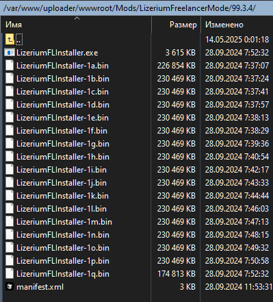
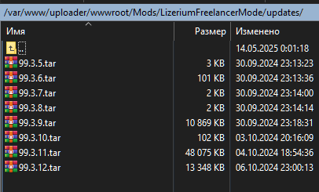

# 💣 Публикация модов

## Структура папок мода на сервере

Для мода `LizeriumFreelancerMode` на `LizeriumServer` используется следующая структура:

```text
Mods/
└── LizeriumFreelancerMode/
    ├── 99.3.4/
    ├── updates/
    └── version.xml
```

## Генерация файлов публикации мода

При публикации мода необходимо:

- сгенерировать `manifest.xml`
- подготовить установочные файлы к `deploy`

Эти файлы будут размещены в каталоге:

```text
Mods/LizeriumFreelancerMode/99.3.4
```

Для этого используется Publisher из проекта [AppUpdater.Publisher](../AppUpdater.Publisher/bin/Release)

> Команда генерации

```sh
.\AppUpdater.Publisher.exe -source:.\INPUT\3_FL_APP\ -target:.\MODS\ -version:99.3.4 -deltas:2
```

> [!IMPORTANT]
> Дополнительно необходимо дробить игровые файлы на `.bin` части как можно меньшего размера.
> Это делается через **Inno Setup** скрипт, который лежит первым в проекте (у вас может быть свой скрипт и свой вариант дробления), например:
>
> ```text
> 99.3.4.iss
> ```

## Загрузка файлов мода на сервер

После генерации файлов публикации необходимо забрать всё содержимое из папки со сформированными бинарниками и перенести его вместе с манифестом внутрь сервера.



## Файл версии мода

В файле:

```text
Mods/LizeriumFreelancerMode/version.xml
```

необходимо указать:

- актуальную версию игры
- номер последнего архива обновления, доступного в `Mods/LizeriumFreelancerMode/updates`

Пример:

```xml
<config>
    <version>99.3.4</version>
    <updates>99.3.12</updates>
</config>
```

## Архивы обновлений

В папку:

```text
Mods/LizeriumFreelancerMode/updates
```

необходимо загружать архивы обновлений.

> [!TIP]
> Архивы формируются следующим образом:
>
> 1. Сначала создаётся архив `.7z` с **ультра-сжатием** `LZMA2`
> 2. Затем из полученного `.7z` создаётся `.tar` архив


