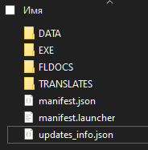

# 📦 Формат обновлений

## Содержимое архива обновления



### `manifest.launcher`

Файл `manifest.launcher` содержит информацию о продукте и версии обновления.

Пример:

```xml
<?xml version="1.0" encoding="utf-8" ?>
<config>
    <name>LizeriumFreelancerMode</name>
    <version>99.3.12</version>
</config>
```

### `updates_info.json`

Файл `updates_info.json` содержит:

- информацию о последнем обновлении
- список изменений
- категории обновлений

<details>
<summary>Содержимое</summary>

```json
{
	"Comment": "Приятной игры тебе, ведь это абсолютно бесплатно.",
	"Categories": [
		{
			"name": "GAME_UNIVERSE",
			"title": "Универсальные обновления клиента игры"
		},
		{
			"name": "GAME_SINGLE",
			"title": "Обновления одиночной игры"
		}
	],
	"Updates": [
		{
			"name": "99.5.1",
			"data": [
				{
					"category": "GAME_UNIVERSE",
					"values": ["text_GAME_UNIVERSE"]
				},
				{
					"category": "GAME_SINGLE",
					"values": ["text_GAME_SINGLE"]
				}
			]
		}
	]
}
```

</details>

## Что должно лежать внутри архива обновления

В корне архива должны лежать только те файлы и папки, которые **должны измениться** во Freelancer и связанных игровых файлах.

Структура должна соответствовать оригинальной структуре Freelancer.

> [!IMPORTANT]
> Разница между старой и новой версией рассчитывается **пофайлово программно**.
> Инструменты для расчёта этой разницы есть как в этом проекте, так и на стороне.

Для сравнения папок игры и выделения разницы используется специальная программа:

[Lizerium Find Changes](https://github.com/Lizerium/LizeriumFindChanges)

Она также создаёт специальный манифест, необходимый для корректной работы обновления.
